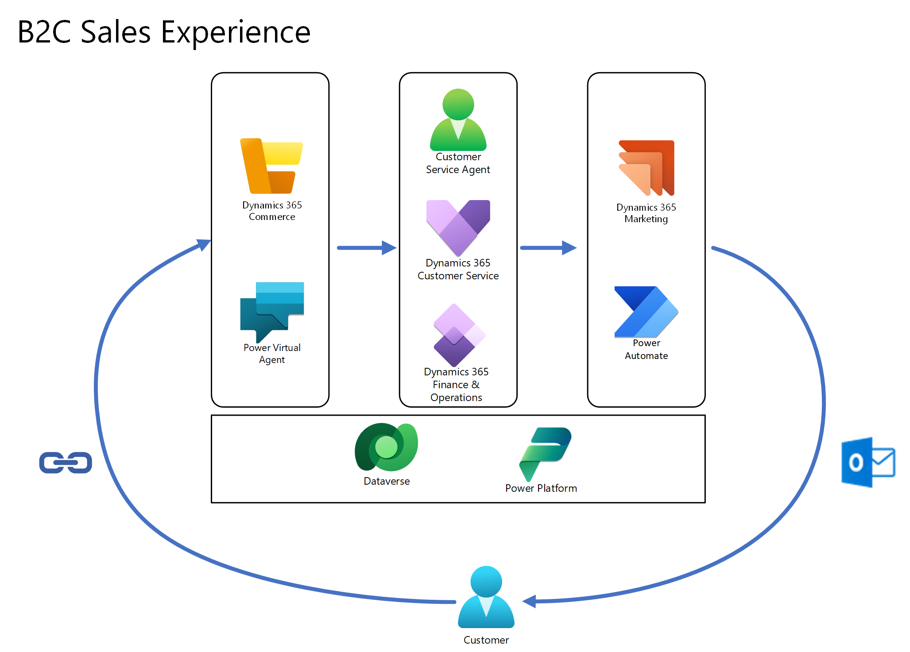
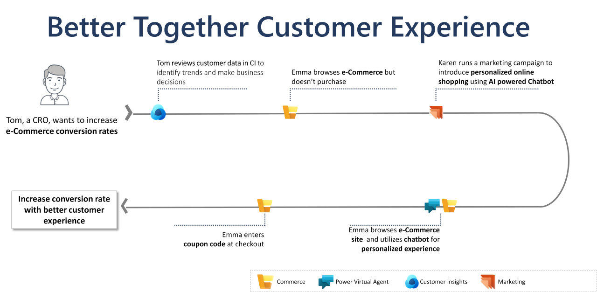

# Better Together – After Customer Customer Service

This solution combines Dynamics 365 Commerce, Dynamics 365 Marketing, Power Virtual Agent and Customer Service to provide a comprehensive after sales experience.

# Architecture

# Dataflow

1.	Dynamics 365 Marketing sends promotional email to customer using Power Automate.
2.	Customer receives email and opens eCommerce website.
3.	Customer uses Power Virtual Agent on ecommerce website to talk with Customer agent.
4.	Customer service Agent(CSA) uses Omni-channel customer service to access the customer data.
5.	CSA adds the helmet to order as requested by customer. 
6.	Dynamics 365 Commerce prompts CSA to upsell/cross-sell related products.
7.	CSA adds a lock to the order and utilizes the Commerce reauthorization functionality to process payment using the same card on file.

# Components

-   [Dynamics 365 Commerce](https://dynamics.microsoft.com/commerce/capabilities/) can help retailers to deliver personalized, seamless shopping experiences across physical and digital channels. It’s used here by the end consumer to shop online. It’s also used by the retail merchandizer to create and activate a coupon code.
-   [Dynamics 365 Marketing](https://dynamics.microsoft.com/marketing/capabilities/) helps you unify your customer information, providing marketing automation features, and allowing you to create personalized event-triggered marketing campaigns. It’s used here to create a campaign that sends emails to target customers, giving them coupon code and inviting them to buy from the online channel.
-   [Power Virtual Agent](https://powervirtualagents.microsoft.com/) (PVA) lets you create powerful AI-powered chatbots for a range of requests—from providing simple answers to common questions to resolving issues requiring complex conversations. Here, PVA is used on the online channel to help consumers have a better shopping experience and get all the information they need before they buy a product.
-   [Dataverse](https://powerplatform.microsoft.com/dataverse/) lets you securely store and manage data that's used by business applications. It’s used here to link customer insights to marketing data.
-   [Dynamics 365 Customer Service](https://dynamics.microsoft.com/customer-service/overview/) Transform customer experiences by empowering agents to drive faster resolution using generative AI and automation.

# Scenario details

In the quarterly review presentation with the Chief Revenue Officer (CRO), it was observed that the amount of recurring revenue from customers purchasing high-value items such as bicycles and kayaks is below anticipated levels.

During the meeting , they decided to run marketing email targeting customers who buy high-value items.

They decided to start with Bicycle category and send personalized email upselling bicycle accessories available on website for the customer.

Customer clicks on link provided in the email to visit e-commerce site. He talks to customer service agent(CSA) via chatbot to add additional items to existing order.

In the single application , CSA is able to chat with customer and check customer existing order information with embedded Dynamics 365 Commerce.

The CSA possesses the ability to offer personalized suggestions pertaining to the customer's existing purchase through upselling or cross-selling feature in Dynamics 365 Commerce.

Customer went ahead with CSA suggestions. 

CSA is able reuse  the existing card without asking customer for card details again from original order to complete the payment.

This story showcases how Dynamics 365 applications  - Commerce, Marketing, Power Virtual agent, Customer Service works together to improve Customer experience with personalized after Sales experience.

In the next quarterly business review , The Chief Revenue Officer sees increase in repeat customer revenue for high-value items.

# Potential use cases

This solution was created to provide a better sales experience for online customers. It can be applied in industries like retail, financial services, manufacturing, and health care. It can be used by any organization that wants to bring Dynamics 365 apps together to analyze customer data across systems to improve their customer experience.

You can use this solution to:

-   Gain better insights from your customer data.
-   Target prospects to convert them to customer.
-   Provide personalized and in-store-like experience for online customers.
-   Run targeted promotions that are aimed at customer retention or upselling.

# Deploying the Scenario

## Pre-requisites

-   Dynamics 365 demo environments 
    - If you do not have demo environment , refer to this page [Get started with a Dynamics 365 free trial](https://dynamics.microsoft.com/dynamics-365-free-trial/)

-   Dyanmics 365 Commerce with E-commerce
    -   Setup guide: [E-commerce site overview - Commerce \| Dynamics 365 \| Microsoft Learn](https://learn.microsoft.com/dynamics365/commerce/online-store-overview)
    -   Power Virtual Agent embed in E-commerce: [Commerce Chat with Power Virtual Agents module - Commerce \| Dynamics 365 \| Microsoft Learn](https://learn.microsoft.com/dynamics365/commerce/chat-module-pva)
-   Power Platform in LCS:
    - Setup Guide [Enable Power Platform Integration - Finance & Operations | Dynamics 365 | Microsoft Learn](https://learn.microsoft.com/dynamics365/fin-ops-core/dev-itpro/power-platform/enable-power-platform-integration)
-   Enable Dataverse solutions for Dual write
    - Setup Guide [Enable dual-write for existing finance and operations apps - Finance & Operations | Dynamics 365 | Microsoft Learn](https://learn.microsoft.com/dynamics365/fin-ops-core/dev-itpro/data-entities/dual-write/enable-dual-write)
-   Dynamics 365 Marketing
    -   Setup guide: [Get started with Marketing app setup (Dynamics 365 Marketing) \| Microsoft Learn](https://learn.microsoft.com/dynamics365/marketing/get-started)
-   Dynamics 365 Customer service
    -   Install Customer service: [Availability of Customer Service Hub](https://learn.microsoft.com/dynamics365/customer-service/availability-customer-service-hub)
-   Omnichannel customer service
    -   [Commerce Chat with Omnichannel for Customer Service module - Commerce \| Dynamics 365 \| Microsoft Learn](https://learn.microsoft.com/dynamics365/commerce/commerce-chat-module)

## Configuration

### Step 1: Configure Dual Write
If you have not configured dual write, you need to follow mentioned link from our B2B Lead to Cash Story.And if you have already configured dual write, make sure you review it before moving to next step
[Enable Dual Write](https://github.com/microsoft/Dynamics-365-FastTrack-Implementation-Assets/blob/bt-may2023/Commerce/BetterTogether/B2BSalesExperience.md#step-1-enable-dual-write-in-dynamics-365-commerce)

### Step 2: Create Trigger in Marketing

[Create custom triggers in real-time marketing (Dynamics 365 Marketing) | Microsoft Learn](https://learn.microsoft.com/dynamics365/marketing/real-time-marketing-custom-triggers)

### Step 3: Create Powerapps flow with Dataverse

This step is needed as sales line is not available OOB in marketing.
Steps to create custom database trigger - [Creat custom database trigger](https://www.ameyholden.com/articles/real-time-dynamics-marketing-custom-triggers-dataverse?rq=trigger)

### Step 4: Define Journey in Marketing using Trigger

[Trigger a journey based on a Dataverse record change (Dynamics 365 Marketing) | Microsoft Learn](https://learn.microsoft.com/dynamics365/marketing/real-time-marketing-dataverse-trigger)

### Step 5: Setup Omnichannel the Customer Service admin

Install the [Commerce in Customer Service](CommerceCustomerServiceAddInSolutionsPackage_1_3.zip) Add-in package into your Customer Service instance. This will allow a customer service agent to login and display Dynamics 365 Commerce forms within the Customer Service application.

### Step 6: Create a Topic for the Power Virtual Agent

This documentation page explains how to create topics for the PVA chatbot.

[Use topics to design a chatbot conversation - Power Virtual Agents \| Microsoft Learn](https://learn.microsoft.com/power-virtual-agents/authoring-create-edit-topics)

## Additional reference topics

**E-comm with Omnichannel for customer service –** Commerce chat with Omnichannel can be transferred to agent if user want to ask more personalized queries. It provides omnichannel view of customers within CE application to help answer customer specific information. Chat experience is full embedded in our E-Commerce site and works seamlessly between pages.

-   Prerequisites for Omnichannel for Customer Service
    -   Configure chat in the Omnichannel for Customer Service Administration widget and embed parameters within E-comm site. For instructions, see [Configure a chat channel](https://learn.microsoft.com/dynamics365/customer-service/set-up-chat-widget).
-   Steps:
    -   Configure the Commerce chat experience for your e-commerce site
    -   Add Commerce headquarters as an application tab for Omnichannel for Customer Service
    -   Enable a new application tab for customer agents in Dynamics 365 Omnichannel for Customer Service
    -   Add context variables in Dynamics 365 Omnichannel for Customer Service
    -   Update Content Security Policy (CSP) in site builder
    -   Integrate PVA with Commerce Site : [Commerce Chat with Power Virtual Agents module - Commerce \| Dynamics 365 \| Microsoft Learn](https://learn.microsoft.com/dynamics365/commerce/chat-module-pva)

[For detailed steps, see Commerce Chat with Omnichannel for Customer Service module - Commerce \| Dynamics 365 \| Microsoft Learn](https://learn.microsoft.com/dynamics365/commerce/commerce-chat-module)

**For any questions or concerns , please contact us at DynamicCrossApp@microsoft.com**
